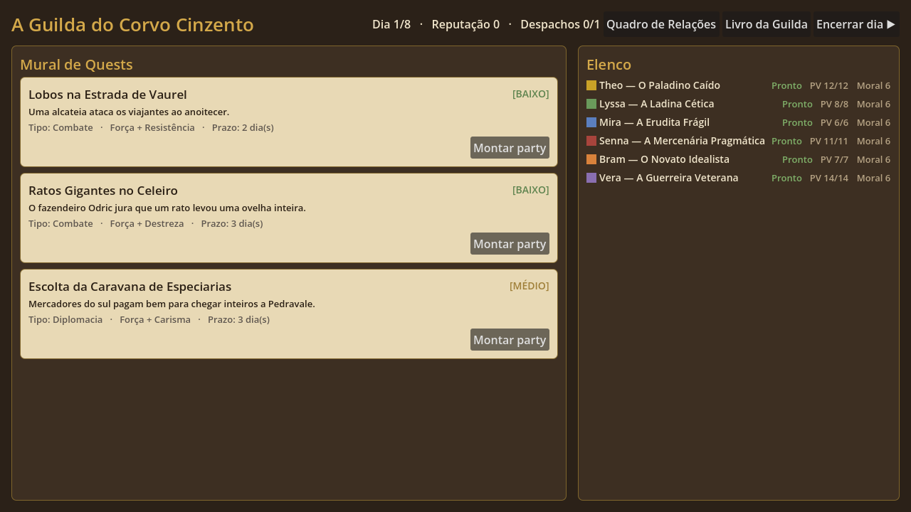
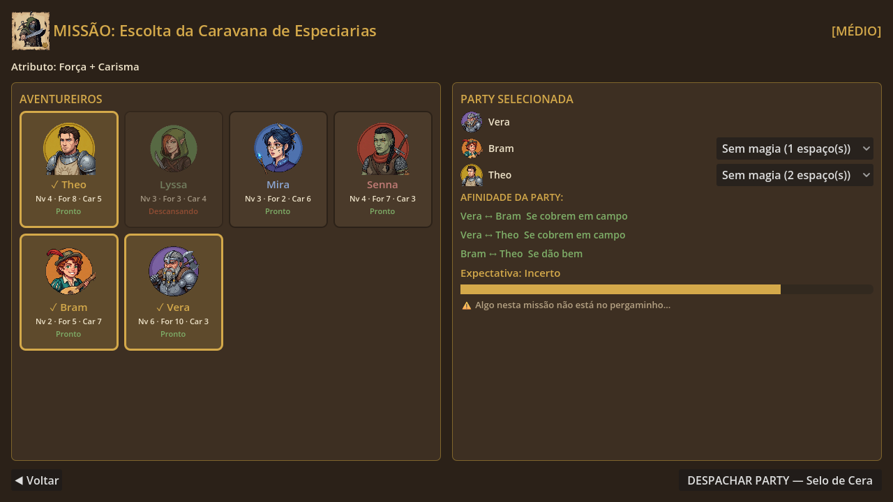
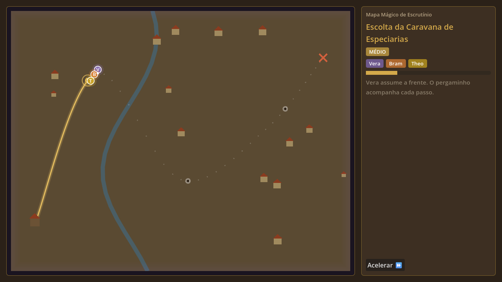
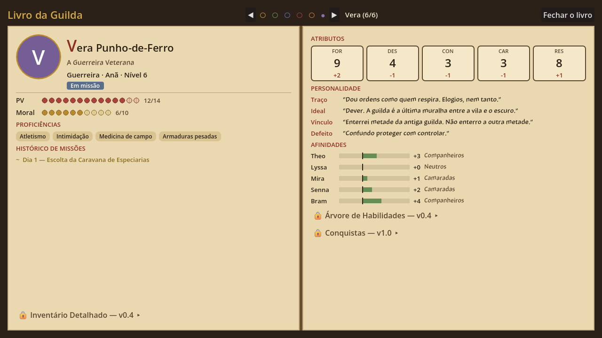
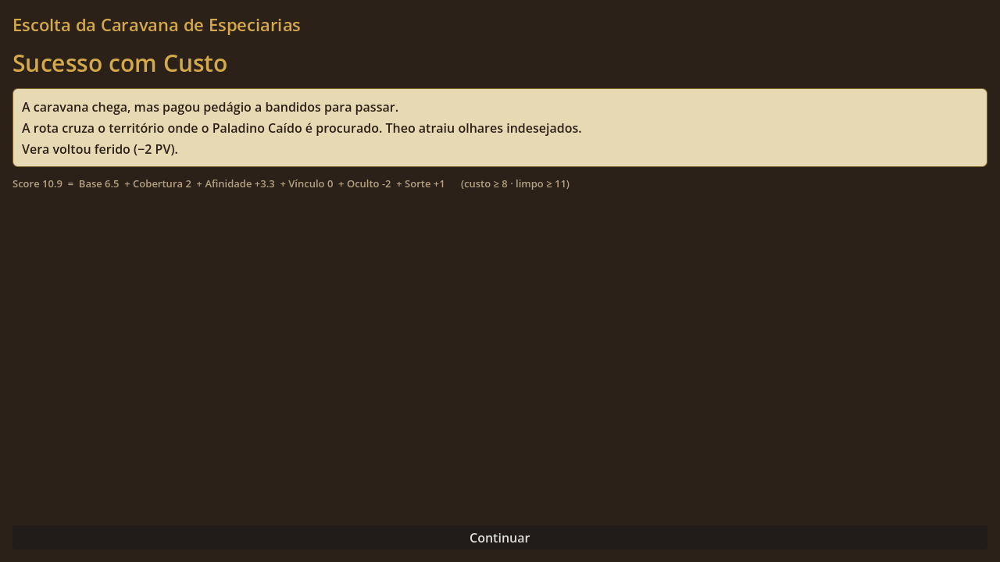

# A Guilda

> *"Quem você envia define quem eles se tornam."*

Jogo de gerenciamento narrativo em fantasia medieval, inspirado no loop de despacho de **Dispatch** (AdHoc Studio). Você não é o herói — é o(a) **Mestre(a) de Despacho** da decadente Guilda do Corvo Cinzento, e decide **quem vai, com quem, e como**.

O jogo não é sobre combate. É sobre gestão de gente complicada com poder de matar dragões: egos, rivalidades, dívidas de honra e vínculos que mudam conforme você monta as parties.



## Como se joga

1. **Mural de Quests** — pedidos chegam a cada dia, com risco, prazo e atributos exigidos.
2. **Montagem de Party** — escolha de 1 a 4 aventureiros. O preview mostra a afinidade entre eles, mas nunca o resultado.
3. **Despacho** — confirme com o Selo de Cera.
4. **Mapa Mágico** — você acompanha a party pelo mapa: a rota se revela em dourado, os marcadores avançam e cada ponto de interesse narra o que acontece. Você assiste, não controla.
5. **Resolução** — Sucesso Limpo, Sucesso com Custo ou Falha com Revelação. Falhar nunca é beco sem saída: é gancho de história.
6. **Vínculos** — quem vai junto se aproxima ou se afasta. Ao cruzar limiares, você decide o que existe entre eles (Amizade, Mentoria, Rivalidade, Romance...), e isso desbloqueia **Ações de Vínculo**.
7. **Encerrar o dia** — aventureiros descansam, missões expiram, novos pedidos chegam.

| Montagem de Party | Mapa Mágico |
|---|---|
|  |  |
| **Livro da Guilda** | **Resolução** |
|  |  |

## Estado atual — MVP v0.2

- 6 aventureiros (Theo, Lyssa, Mira, Senna, Bram, Vera) com atributos e grade de afinidade assimétrica.
- 10 missões, com tags de composição (exige especialista, proíbe herói) e requisito oculto.
- Score normalizado: `Base + Cobertura + Afinidade + Vínculo + Oculto + Sorte` (GDD §5.6).
- Fadiga (Pronto / Cansado / Exausto), moral, reputação e slots de despacho por dia.
- Eventos de vínculo em +3, +6, +9, −3 e −5, com escolha de rótulo.
- Ações de Vínculo: Impulso do Mentor, Cobertura Mútua, Esforço Extra, Competição, Sincronia Perfeita.
- **Mapa Mágico** (GDD §13): 5 biomas desenhados por código, rota sinuosa revelada aos poucos, marcadores por herói, 3 waypoints com narração e botão de acelerar.
- **Livro da Guilda** (GDD §14): ficha D&D 5e resumida — retrato, classe, raça, nível, PV, moral, status, proficiências, histórico, atributos com modificador, personalidade (Traço, Ideal, Vínculo, Defeito) e barras de afinidade.
- PV: missões com custo ou falha ferem; o descanso cura; com 0 PV o herói fica Incapacitado.
- Quadro de Relações e fim de capítulo no dia 8.

## Rodar

Requer **Godot 4.7**. Abra a pasta no editor e pressione **F5**.

## Estrutura

| Caminho | Conteúdo |
|---|---|
| `data/heroes.json` | Elenco: atributos, cor, traço e grade de afinidade inicial (`a → b`) |
| `data/missions.json` | Missões: risco, atributos, prazo, tags, requisito oculto e textos de resultado |
| `scripts/core/score_calc.gd` | Fórmula de score e limiares |
| `scripts/core/game_state.gd` | Autoload `GameState`: elenco, afinidade, vínculos, despacho, fadiga, moral, reputação, dias |
| `data/narration.json` | Narração do Mapa Mágico por partida, bioma e resultado |
| `data/book.json` | Seções trancadas do Livro (slots de expansão por versão) |
| `scripts/ui/main.gd` | Telas, montadas por código |
| `scripts/ui/magic_map.gd` | Mapa Mágico: desenho do bioma, rota, waypoints e marcadores |
| `scripts/ui/guild_book.gd` | Livro da Guilda: ficha em duas páginas |
| `tests/` | Testes headless de regras e telas, e gerador de screenshots |
| `docs/GDD.md` | Game Design Document |

A regra de jogo fica em `scripts/core`; a UI só lê o estado e chama métodos. Heróis, missões e textos novos entram pelos JSON, sem mexer em código.

### Expandindo o Livro da Guilda

- **Campo novo na ficha:** adicione no herói em `heroes.json`. Todos os campos da ficha são opcionais, com valor padrão em `GameState.new_game`.
- **Retrato:** preencha `"portrait": "res://art/portraits/vera.png"`. Sem imagem, o livro mostra a inicial na cor do herói.
- **Seção nova:** entre como trancada em `data/book.json` (`page`, `title`, `version`, `desc`). Quando for implementada, remova da lista e desenhe em `guild_book.gd` (`_left_page` ou `_right_page`).

## Testes

```bash
godot --headless --path . -s res://tests/sim_test.gd
godot --headless --path . -s res://tests/ui_smoke.gd
```

`sim_test.gd` confere a tabela de calibragem do GDD, as regras de assimetria, fadiga e Mentoria, e joga 200 partidas aleatórias. `tests/screenshots.gd` (com janela, sem `--headless`) regenera as imagens em `user://shots`.

## Roadmap

- [x] **v0.1** — loop de despacho
- [x] **v0.2** — party, afinidade, Ações de Vínculo *(atual)*
- [ ] **v0.3** — Mapa Mágico ✔, Livro da Guilda ✔, eventos de bastidor, neglect
- [ ] **v0.4** — capítulos, Ato 1 completo, upgrades da guilda
- [ ] **v1.0** — arte, trilha sonora, minigame opcional, finais variáveis

## Créditos

Design: Rafael Jr. Detalhes completos em [docs/GDD.md](docs/GDD.md).
